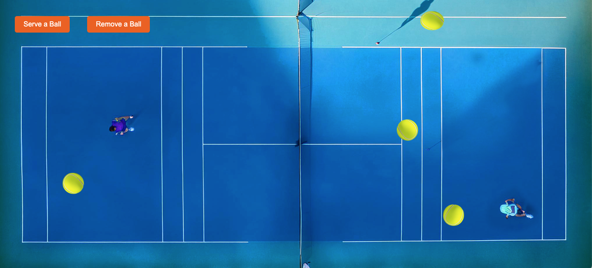

# Full Stack Developer Exercise

## Tennis Ball Simulation

This project is a fun and interactive simulation of tennis balls bouncing around within a tennis court. The simulation showcases basic physics such as collision detection and includes visual effects like image changes and ball deformation upon impact with the walls. The project is designed to demonstrate JavaScript, HTML, and CSS skills in creating dynamic web animations.

## Features

- Tennis Ball Simulation: Balls move around the screen, bouncing off walls with realistic physics.
- Dynamic Image Changes: The balls change their appearance when they hit different walls.
- Squeeze Effect: Balls simulate deformation by "squeezing" when they collide with the walls, mimicking real-life physics.
- Responsive Design: The simulation is designed to work across different screen sizes, ensuring a consistent experience.

## Files

- `serve.html`: The main HTML file.

## How to run

1. Open `serve.html` in a web browser.
2. Use the control buttons to Serve a Ball or Remove a Ball from the animation.
3. Preview: <a href="https://ceciliosanchez.com/github/xpro/tennis_simulation/serve.html" target="_blank">Tennis Ball Simulation</a>

## Support

Reach out at http://ceciliosanchez.com/contact/

## License

This project is licensed under the MIT License.
